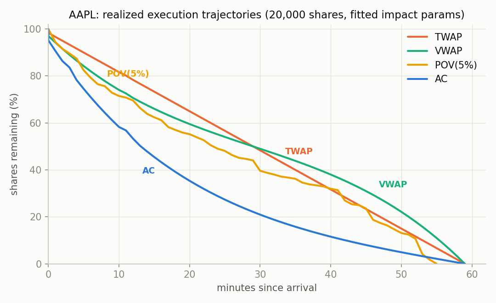
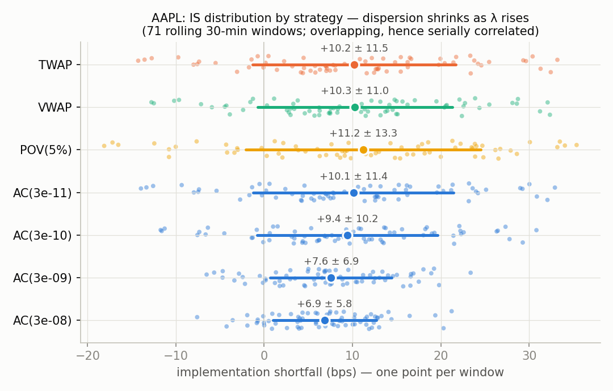
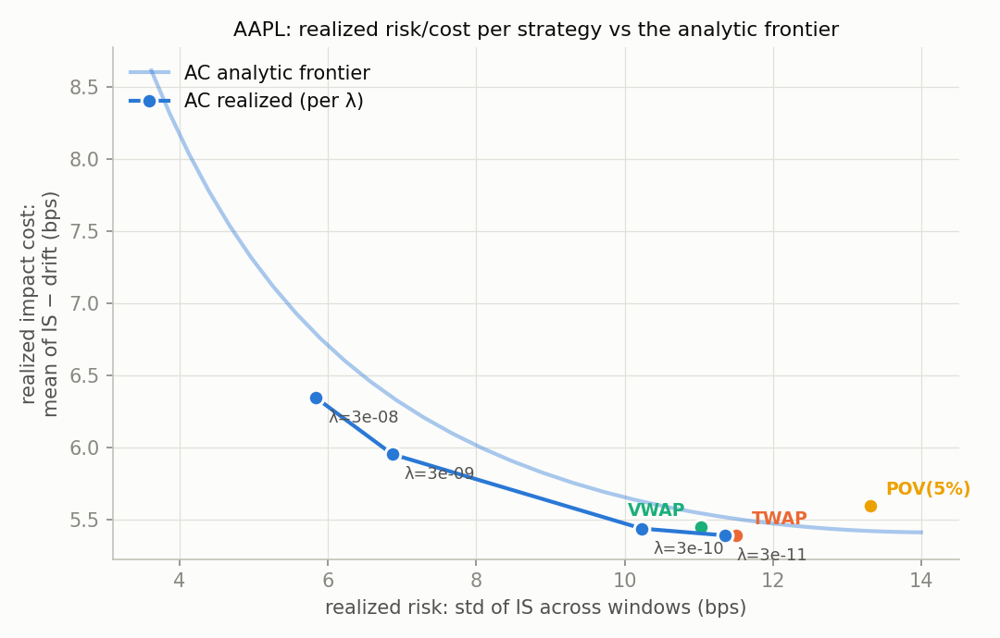

# Optimal Execution Engine

This project addresses the problem of optimal trade execution: liquidating a
large equity position over a fixed time horizon while minimizing total
transaction cost. Executing an order too quickly consumes available
liquidity and pushes the price against the trader, a cost known as market
impact. Executing it too slowly leaves the position exposed to adverse price
movement for longer, a risk known as timing risk or price drift. The
Almgren-Chriss (2000) framework formalizes this tradeoff and derives a
specific optimal execution schedule. This project implements that framework
end to end and validates it against real historical exchange data.

## Why this is hard

This is a nontrivial problem in practice, not only an academic one:
execution trading desks employ dedicated systems and personnel to solve it,
because the cost of an incorrect schedule is realized capital, not a test
metric. Market impact and timing risk cannot simply be added together and
minimized as one number. Market impact is a near-certain cost the trader
imposes on itself; timing risk is uncertainty the trader is exposed to.
There is no single schedule that is best in every situation, only a
tradeoff that depends on how much risk the trader is willing to accept.
Producing a schedule that is provably optimal for a stated risk preference,
and confirming that the tradeoff holds on real market data
rather than only in the model's own accounting, is the core engineering
problem this project addresses.

## Results

Real 2012 NASDAQ order-by-order data (LOBSTER) for AAPL was replayed through
a simulator that walks the actual historical order book. Four strategies,
TWAP (uniform time-slicing), VWAP (volume-weighted slicing), POV (a fixed
percentage of observed market volume), and the Almgren-Chriss optimal
schedule, were tested under identical conditions across 71 independent
windows spanning the trading day.


*How fast each strategy liquidates the position over time.*


*Implementation shortfall distribution by strategy. Dispersion narrows as
the risk-aversion parameter increases.*


*Realized cost and risk per strategy plotted against the model's analytic
efficient frontier, the minimum cost achievable at each risk level.*

**Headline results** (cost measured in basis points, bps; 1 bp = 0.01% of
trade value):

- The optimal schedule reduced execution risk, how much cost varies from
  trade to trade, from 11.5 bps to 5.8 bps, roughly a factor of two, at a
  cost of under one additional basis point in expected impact (5.39 to
  6.35 bps).
- The POV strategy was dominated: it produced both higher expected cost
  (5.60 bps) and higher risk (13.3 bps) than the optimal schedule, meaning
  there was no risk tolerance for which POV was the better choice.
- Realized cost matched the model's analytic prediction to within 0.15 bps
  across most of the tested range. At the most aggressive setting tested,
  realized and predicted cost diverge by approximately 2 bps. This
  divergence corresponds to the point at which the schedule demands
  execution faster than the visible order book has liquidity to absorb, a
  physical constraint the linear-impact model does not represent.

## How it works

The execution schedule is governed by a single risk-aversion parameter,
denoted λ. At λ = 0, the model reduces exactly to uniform time-slicing
(TWAP): impact is minimized by trading at a constant rate, and timing risk
is simply accepted. As λ increases, the schedule front-loads execution,
trading faster to reduce exposure to price uncertainty at the cost of
higher expected impact. At any level of λ, the model produces an exact
selling schedule that balances expected cost against how much that cost
could vary. The λ = 0 case is not a separate heuristic bolted onto the
general solution; it is the exact edge case of the same formula, which
serves as a useful internal consistency check on the implementation.

The full derivation, including the closed-form solution, the drift and
resilience extensions, and the calibration methodology, is documented in
[MODEL.md](MODEL.md).

## Engineering highlights

- **C++20 core, Python analysis layer.** Parsing, order book replay,
  execution simulation, and the optimal-schedule solver are implemented in
  C++ for performance and correctness. Calibration and plotting are
  implemented in Python. The two layers do not duplicate logic: Python
  performs regression over CSV output already produced by tested C++
  tools, so trap-prone logic has exactly one implementation.
- **Built against real exchange data, not synthetic fixtures.** The
  LOBSTER message feed presents several correctness hazards: multi-level
  order book sweeps arrive as several same-timestamp rows that must be
  aggregated into a single trade event, hidden-order executions carry
  unreliable direction and must be classified from surrounding quotes,
  and a price level that scrolls outside the visible depth window and
  later returns can appear as phantom liquidity if the implementation
  does not explicitly account for that blind spot in the data format.
  This last case was identified through debugging on real AAPL data, not
  by code inspection, and is covered by a regression test.
- **Independently verified.** The closed-form solver is checked against
  an independently implemented numerical solution to the same
  optimization problem, a different algorithm sharing no code path,
  agreeing to one part in 10^11. The order book reconstruction, built
  from the raw event stream with no dependence on the exchange's own
  snapshot data, was validated row by row against the exchange's
  recorded book state across all 1.17 million rows in the three test
  datasets, with zero contradictions.
- **Two independent estimators for temporary impact, one reported as a
  negative result.** The straightforward estimator, regressing realized
  trade cost on trade size, has near-zero explanatory power (R² ≈ 0) on
  this data, because traders size orders to available liquidity rather
  than the reverse, producing selection bias. The estimator used instead
  replays the historical order book to directly measure the cost of
  consuming a given size, fits substantially better (R² ≥ 0.97), and
  independently reproduces the exchange's quoted bid-ask spread as a
  consistency check. Both estimators are implemented, and the failure
  mode of the first is documented rather than omitted.
- **Explicit validation of a core modeling assumption.** The backtester
  assumes, consistent with Almgren-Chriss, that order book depth
  replenishes instantly between trades. Rather than leave this unstated,
  the project measured post-trade depth recovery directly from the data
  and implemented a second impact model with an explicit decay rate to
  quantify the effect of relaxing that assumption. The
  instant-replenishment assumption held up as reasonable at the trade
  sizes tested; this is a measured conclusion, not an assumed one.
- **92 automated tests.** GitHub Actions CI runs the full suite on Linux
  and macOS in both Release and Debug configurations, plus dedicated
  AddressSanitizer and UndefinedBehaviorSanitizer jobs that exercise the
  full test suite and the command-line tools against real market data.

## Limitations

- **The backtest is not a full counterfactual.** Historical order book
  states are replayed as they occurred, in a world where the simulated
  strategy's own orders never existed. The simulator charges the
  strategy for the liquidity its own trades consume and carries forward
  the resulting price shift for that strategy's subsequent orders, but
  it does not model how other market participants would react to that
  order flow: no simulated cancellations or requoting. Reported costs
  should be interpreted as a reasonable lower bound, and comparisons
  between strategies, all subject to the same bias, are more reliable
  than any single absolute number.
- **Single trading day per ticker.** The 71-window result draws from
  overlapping windows within one trading day, so the samples are
  correlated rather than independent, and results depend on that day's
  realized price path. This limitation is stated directly alongside the
  results.
- **No modeling of passive orders or queue position.** Every simulated
  order trades immediately at the best available price, consistent with
  how the underlying model works: it specifies how fast to trade, not
  the odds of getting filled while waiting in a queue. Modeling passive
  orders correctly would require modeling adverse selection (the risk
  that a resting order only gets filled when the price is about to move
  against it), which is outside the scope of this project.
- **The optimal schedule is not well-defined for every instrument
  tested.** For one of the three tickers (INTC), the calibrated
  parameters violate a condition the model requires to produce a valid
  answer. This is a genuine, disclosed finding, documented in MODEL.md,
  and the implementation detects and reports the condition rather than
  returning a degenerate result.

## How to run

```bash
cmake -B build -DCMAKE_BUILD_TYPE=Release && cmake --build build -j
ctest --test-dir build --output-on-failure     # 92 tests

# Get sample data (see data/README.md), then per ticker:
./build/oee_dump --msg <message.csv> --book <orderbook.csv> --out-dir results/dump/AAPL
python3 python/calibrate.py --dump-dir results/dump/AAPL --ticker AAPL

python3 -m venv .venv && .venv/bin/pip install matplotlib
.venv/bin/python python/run_sweep.py --calib results/dump/AAPL/calib.json \
    --ticker AAPL --msg <message.csv> --book <orderbook.csv> --qty 20000
.venv/bin/python python/plot_results.py --dir results/AAPL --ticker AAPL

./build/oee_windows --msg <message.csv> --book <orderbook.csv> --qty 10000 \
    --gamma 0.421774 --eta 1.13567 --sigma 2694.48 --epsilon 750 \
    --out results/AAPL/windows.csv
.venv/bin/python python/plot_distributions.py --dir results/AAPL --ticker AAPL

./build/oee_rebuild --msg <message.csv> --book <orderbook.csv>   # book validation
```

## Future work

- **Multiple trading days per ticker**, to determine whether the
  single-day findings, particularly the resilience measurement, which
  was inconclusive given limited data, generalize.
- **A counterfactual execution simulator**, inserting synthetic orders
  directly into the message-driven order book reconstruction (already
  implemented for validation) so that other participants' reactions are
  modeled rather than assumed away.
- **Passive and limit-order strategies with queue-position modeling**,
  requiring an honest treatment of adverse selection rather than
  exclusion from scope.
- **Multi-asset execution**, coordinating schedules across a basket of
  correlated instruments rather than a single security.

## Reference data

LOBSTER (lobsterdata.com) academic limit order book data: AAPL, INTC, GOOG,
2012-06-21. See [MODEL.md](MODEL.md) for the full derivation, calibration
methodology, and academic references.
